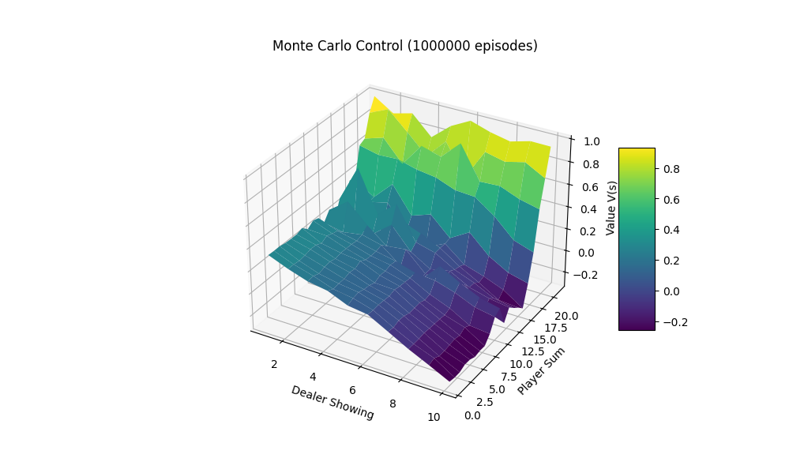

# Easy21

Implementation of the Easy21 assignment from David Silver's Reinforcement Learning course.

## Results

Monte carlo agent after training for 1,000,000 episodes learnt the following optimal value function

